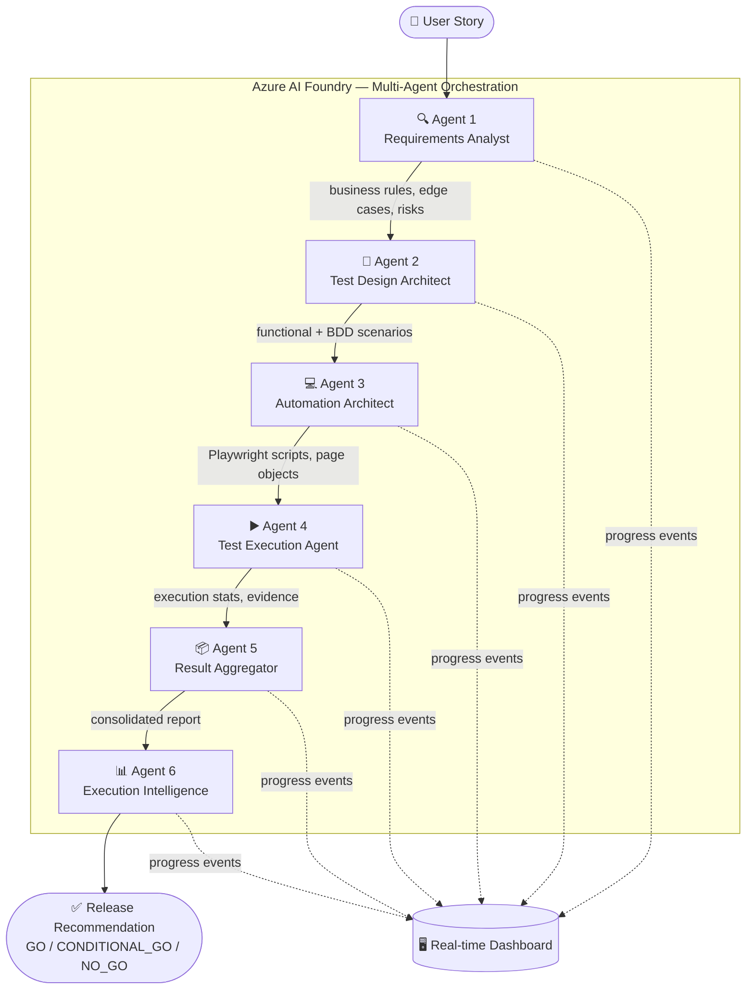
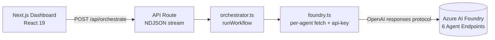
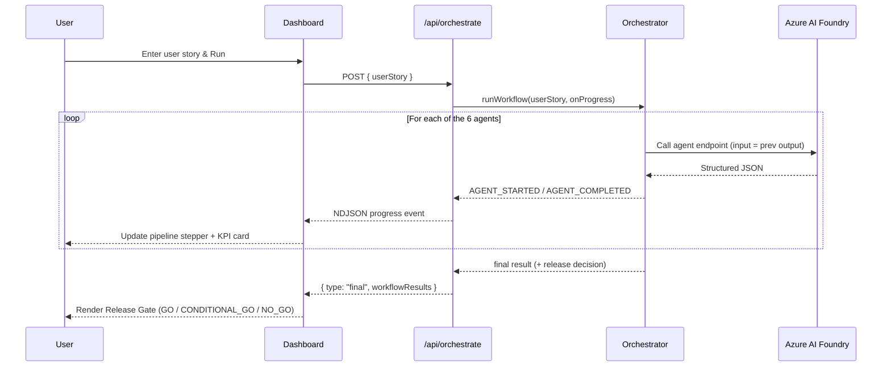

<div align="center">

# 🧪 TestFlow AI

### Transform User Stories into Test Automation and Release Intelligence using Multi-Agent AI

A multi-agent quality engineering platform built on **Microsoft Azure AI Foundry** that automates the complete software testing lifecycle — from a plain-language user story all the way to a release-readiness recommendation.


</div>

---

## 📖 Project Overview

TestFlow AI automates the entire software testing lifecycle through a coordinated network of **six specialized AI agents** that collaborate sequentially. Starting from a single user story, the platform extracts requirements, designs tests, generates Playwright automation, executes and aggregates results, and finally produces a **GO / CONDITIONAL_GO / NO_GO** release decision — all visualized in a real-time dashboard.

The solution demonstrates **Agent IQ** and **Foundry IQ** through autonomous, structured collaboration between agents orchestrated on Azure AI Foundry.

### The Problem

Software teams spend significant manual effort across fragmented tools and roles on:

- Requirement analysis & business rule extraction
- Test case design & BDD scenario creation
- Automation framework generation
- Test execution & result consolidation
- Release readiness assessment

TestFlow AI collapses this multi-team, multi-tool workflow into a single automated multi-agent pipeline.

---

## 🏗️ Architecture



### High-Level Component View



---

## 🤖 Agent Details

The pipeline runs six agents in sequence. Each is a dedicated Azure AI Foundry endpoint (OpenAI "responses" protocol); the structured output of one becomes the input of the next.

| # | Agent | Purpose | Key Output Fields | Endpoint Variable |
|---|-------|---------|-------------------|-------------------|
| 1 | **Requirements Analyst** | Analyze user stories & extract structured requirements | `business_rules`, `assumptions`, `edge_cases`, `risk_areas` | `REQUIREMENTS_ANALYST_ENDPOINT` |
| 2 | **Test Design Architect** | Transform requirements into test assets | `functional_tests`, `bdd_scenarios`, `coverage_summary`, `traceability` | `TEST_DESIGN_ARCHITECT_ENDPOINT` |
| 3 | **Automation Architect** | Generate automation assets (Playwright) | `framework`, `test_scripts`, `page_objects`, `test_data`, `github_actions` | `AUTOMATION_ARCHITECT_ENDPOINT` |
| 4 | **Test Execution Agent** | Execute or simulate generated automation | `execution_summary`, `failed_tests`, `artifacts` | `TEST_EXECUTION_ENDPOINT` |
| 5 | **Result Aggregator** | Consolidate execution results into a unified report | `summary`, `logs`, `verification_report` | `RESULT_AGGREGATOR_ENDPOINT` |
| 6 | **Execution Intelligence** | Generate quality intelligence & release recommendation | `pass_rate`, `defect_analysis`, `release_readiness`, `recommendation` | `EXECUTION_INTELLIGENCE_ENDPOINT` |

> Agents 4 and 5 are **resilient**: if either call fails, the pipeline continues with a safe fallback so a release verdict is still produced, while the failure is surfaced in the final result.

<details>
<summary><b>Expand full agent specifications</b></summary>

### Agent 1 — Requirements Analyst
**Purpose:** Analyze user stories and extract structured requirements.
**Responsibilities:** Extract business rules · identify assumptions · identify edge cases · identify risk areas · create traceability references.
**Input:** User story → **Output:** `{ business_rules, assumptions, edge_cases, risk_areas }`

### Agent 2 — Test Design Architect
**Purpose:** Transform requirements into test assets.
**Responsibilities:** Generate functional test cases · generate BDD scenarios · create coverage mapping · create traceability matrix.
**Input:** Requirements output → **Output:** `{ functional_tests, bdd_scenarios, coverage_summary, traceability }`

### Agent 3 — Automation Architect
**Purpose:** Generate automation assets.
**Responsibilities:** Generate Playwright test scripts · page objects · test data · utility components · CI/CD configuration.
**Input:** Test design output → **Output:** `{ framework, test_scripts, page_objects, test_data, github_actions }`

### Agent 4 — Test Execution Agent
**Purpose:** Execute or simulate generated automation assets.
**Responsibilities:** Run test suites · collect execution statistics · capture pass/fail information · generate execution evidence.
**Execution summary:** total tests, passed, failed, skipped, pass %, fail %, duration.
**Input:** Automation output → **Output:** `{ execution_summary, failed_tests, artifacts }`

### Agent 5 — Result Aggregator
**Purpose:** Consolidate execution results into a unified report.
**Responsibilities:** Aggregate execution output · consolidate logs & metrics · generate verification summary.
**Input:** Execution output → **Output:** `{ summary, logs, verification_report }`

### Agent 6 — Execution Intelligence
**Purpose:** Generate quality intelligence and release recommendations.
**Responsibilities:** Analyze execution evidence · identify risks · evaluate release readiness · generate quality dashboard · create deployment recommendations.
**Input:** Aggregator output → **Output:** `{ pass_rate, defect_analysis, release_readiness, quality_dashboard, recommendation }`
**Possible decisions:** `GO` · `CONDITIONAL_GO` · `NO_GO` · `NOT_EVALUATED`

</details>

---

## 🔄 Workflow Diagram



---

## 🛠️ Technology Stack

| Layer | Technologies |
|-------|-------------|
| **AI / Agents** | Azure AI Foundry, Azure OpenAI |
| **Frontend** | Next.js 16 (App Router), React 19, TypeScript, Tailwind CSS v4, lucide-react |
| **Automation Target** | Playwright |
| **Integration** | REST APIs (OpenAI "responses" protocol), NDJSON streaming |

---

## 🚀 Setup Instructions

### Prerequisites

- **Node.js 20+**
- An **Azure AI Foundry** project with **six deployed agent endpoints** (one per pipeline stage) and an API key

### 1. Clone & install

```bash
git clone https://github.com/MrGurjeett/testflow-ai.git
cd testflow-ai
npm install
```

### 2. Configure environment

Create a `.env.local` file in the project root:

```bash
# Shared API key for all agent endpoints
AZURE_AI_KEY=your-azure-ai-key

# Optional — defaults to 2025-05-01-preview
AZURE_API_VERSION=2025-05-01-preview

# One full ".../protocols/openai/responses" endpoint URL per agent
REQUIREMENTS_ANALYST_ENDPOINT=https://...   # Agent 1 — Requirements Analyst
TEST_DESIGN_ARCHITECT_ENDPOINT=https://...  # Agent 2 — Test Design Architect
AUTOMATION_ARCHITECT_ENDPOINT=https://...   # Agent 3 — Automation Architect
TEST_EXECUTION_ENDPOINT=https://...         # Agent 4 — Test Execution Agent
RESULT_AGGREGATOR_ENDPOINT=https://...      # Agent 5 — Result Aggregator
EXECUTION_INTELLIGENCE_ENDPOINT=https://... # Agent 6 — Execution Intelligence
```

Each `*_ENDPOINT` is the complete `responses` URL (e.g. `https://<resource>.services.ai.azure.com/.../protocols/openai/responses`); the app appends the `api-version` query parameter automatically. The endpoint-to-agent mapping lives in `AGENT_ENDPOINTS` in [src/services/foundry.ts](src/services/foundry.ts).

### 3. Run the development server

```bash
npm run dev
```

Open [http://localhost:3000](http://localhost:3000) to use the dashboard.

### Available Scripts

| Command | Description |
|---------|-------------|
| `npm run dev` | Start the development server |
| `npm run build` | Build for production |
| `npm run start` | Run the production build |
| `npm run lint` | Run ESLint |

---

## 📡 API Reference

### `POST /api/orchestrate`

Runs the full six-agent workflow and **streams progress** back as newline-delimited JSON (`application/x-ndjson`) — one JSON object per line — so the UI can update agent-by-agent in real time.

**Request body:**

```json
{ "userStory": "As a customer, I want to search products by keyword..." }
```

**Streamed events** (one per line):

```jsonc
// Emitted as each agent starts / finishes / fails
{ "type": "progress", "type": "AGENT_STARTED",   "agent": "RequirementAnalyst" }
{ "type": "progress", "type": "AGENT_COMPLETED", "agent": "RequirementAnalyst", "duration": 2400, "data": { } }
{ "type": "progress", "type": "AGENT_FAILED",    "agent": "TestExecutionAgent", "error": "..." }

// Terminal event on success
{
  "type": "final",
  "workflowResults": {
    "requirements": { },
    "testDesign": { },
    "automation": { },
    "testExecution": { },
    "resultAggregator": { },
    "qualityAssessment": { },
    "status": "SUCCESS",
    "timings": { "agent1": 0, "agent2": 0, "agent3": 0, "agent4": 0, "agent5": 0, "agent6": 0 }
  }
}

// Terminal event on failure
{ "type": "error", "error": "...", "failedAgent": "TestDesignArchitect" }
```

A malformed request (missing `userStory`) returns a plain `400` JSON response instead of a stream.

---

## ☁️ Azure AI Foundry

TestFlow AI uses Azure AI Foundry to:

- Create specialized AI agents with tailored instructions
- Configure and manage agent execution
- Orchestrate multi-agent collaboration
- Monitor agent activity and observability
- Track usage and execution telemetry

Each agent is exposed as an OpenAI-protocol **`responses`** endpoint and invoked directly via `fetch` with `api-key` authentication. All six agents share a single `AZURE_AI_KEY`.

---

## 🧠 Agent IQ

TestFlow AI demonstrates **Agent IQ** through:

- **Specialized responsibilities** — each agent owns one stage of the QA lifecycle
- **Sequential collaboration** — structured outputs flow agent-to-agent
- **Structured data exchange** — typed JSON contracts between stages
- **Autonomous execution** — the workflow runs end-to-end without manual handoffs
- **Quality decision-making** — the final agent issues an actionable release verdict

## 🏭 Foundry IQ

TestFlow AI demonstrates **Foundry IQ** through:

- **Azure AI Foundry agent orchestration**
- **Agent lifecycle management**
- **Monitoring and observability**
- **Execution telemetry**
- **AI-powered workflow automation**

---

## 📈 Business Impact

- ✅ Reduced manual QA effort
- ⚡ Faster test creation
- 🔗 Improved requirement traceability
- 🚀 Accelerated release cycles
- 👁️ Better quality visibility
- 🎯 Consistent testing practices

---

## 🗺️ Future Roadmap

- [ ] Real Playwright execution (beyond simulation)
- [ ] CI/CD integration
- [ ] Autonomous defect triage
- [ ] AI-generated test data
- [ ] Risk-based testing
- [ ] Self-healing automation
- [ ] Predictive quality scoring

---

## 🤝 Contributing

Contributions are welcome!

1. **Fork** the repository
2. **Create a feature branch** — `git checkout -b feature/your-feature`
3. **Commit** your changes — `git commit -m "Add your feature"`
4. **Push** to your branch — `git push origin feature/your-feature`
5. **Open a Pull Request** describing your change

Please run `npm run lint` before submitting, and keep changes focused and well-described.

---

<div align="center">

Built with ❤️ using **Azure AI Foundry** · **Next.js** · **TypeScript**

</div>
